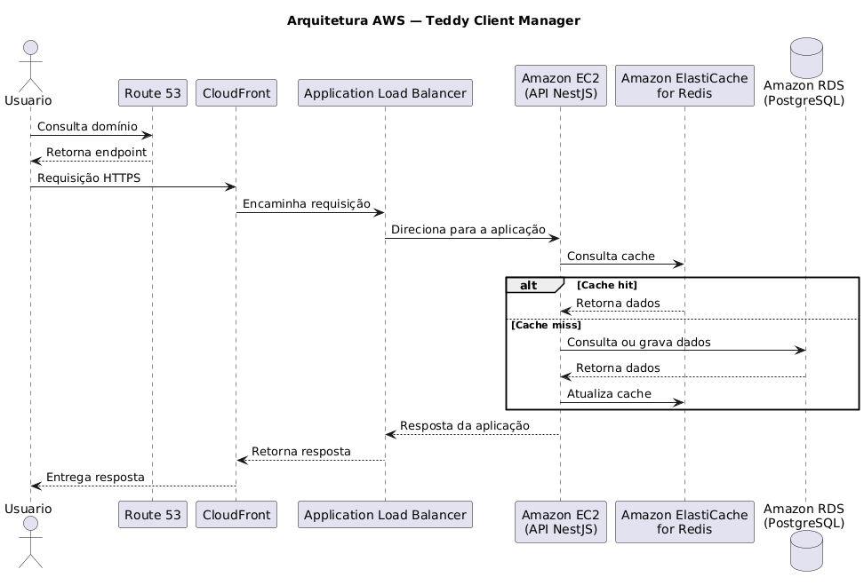
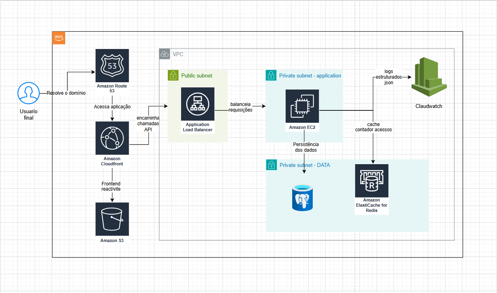

# Teddy Client Manager

Projeto desenvolvido como parte do desafio técnico para a vaga de **Tech Manager
na Teddy Open Finance**.

A proposta foi entregar um MVP full stack com frontend e backend separados,
autenticação por JWT, gestão de clientes e uma base de observabilidade
suficiente para desenvolvimento, testes e acompanhamento operacional.

## Sumário

- [Arquitetura Local](#arquitetura-local)
- [Arquitetura e Princípios](#arquitetura-e-princípios)
- [Arquitetura AWS](#arquitetura-aws)
- [Pré-requisitos](#pré-requisitos)
- [Rodando localmente](#rodando-localmente)
- [Variáveis de ambiente](#variáveis-de-ambiente)
- [Migrations](#migrations)
- [Endpoints da API](#endpoints-da-api)
- [Observabilidade](#observabilidade)
- [Testes](#testes)
- [CI/CD](#cicd)

## Arquitetura Local

```text
Browser  ->  http://localhost:5173  (React + Vite)
		     |
		     v
	     http://localhost:3000  (NestJS API)
		     |
		     v
	    PostgreSQL (porta 5432)
```

A aplicação segue uma estrutura direta:

- frontend React para autenticação, dashboard e gestão de clientes;
- API NestJS centralizando regras de negócio e autenticação;
- PostgreSQL como banco principal;
- observabilidade no backend com logs, métricas e tracing opcional.

## Arquitetura e Princípios

O projeto não segue uma Clean Architecture ou Hexagonal de forma rígida. A
estrutura atual é melhor descrita como um **monólito modular** no backend, com
**organização por features** no frontend e separação leve por camadas.

### Backend

- módulos por domínio, como `auth`, `clients`, `health` e `metrics`;
- controllers recebendo requisições HTTP e delegando a lógica para services;
- services concentrando regras de negócio, validações de fluxo, métricas e
  logging;
- persistência via TypeORM, com repositories e entities próximos do domínio da
  API.

Na prática, o fluxo principal é este:

```text
Controller -> Service -> Repository/Entity -> PostgreSQL
```

### Frontend

- rotas centralizadas em `src/app/app.tsx`;
- páginas e componentes organizados por feature (`auth`, `clients`,
  `dashboard`);
- hooks como `useSession` e `useClientsState` encapsulando estado e chamadas de
  API;
- utilitários compartilhados em `src/shared`.

### Sobre SOLID

Há aplicação parcial de princípios de SOLID, principalmente:

- **Single Responsibility Principle**: controllers, services, hooks e
  componentes têm responsabilidades relativamente bem separadas;
- **Dependency Inversion Principle**: no backend, a injeção de dependências do
  NestJS reduz acoplamento entre serviços, logger, métricas e repositórios;
- **Open/Closed Principle** em nível moderado: novos módulos e endpoints podem
  ser adicionados sem reestruturar a base inteira.

Ao mesmo tempo, é importante não exagerar na consideração de SOLID: o projeto **não** isola
completamente domínio de infraestrutura. Os services ainda dependem diretamente
de recursos como repositories do TypeORM e serviços de observabilidade, então o
desenho está mais próximo de uma arquitetura pragmática para MVP do que de uma
implementação acadêmica de SOLID.

## Arquitetura AWS

Os diagramas abaixo:





proposta de implantação pensada para o desafio.

### Decisões principais da proposta

- CloudFront como CDN e ponto de entrada do frontend.
- Frontend estático servido via S3.
- Backend NestJS executando em EC2 atrás de Application Load Balancer.
- Banco em PostgreSQL gerenciado.
- Observabilidade integrada ao ambiente de execução.


## Pré-requisitos

| Ferramenta     | Versão mínima |
| -------------- | ------------- |
| Node.js        | 20            |
| Docker Desktop | 4.x           |
| npm            | 10            |

## Rodando localmente

```bash
# 1. Instalar dependências
npm install

# 2. Copiar variáveis de ambiente do backend
copy back-end\.env.example back-end\.env

# 3. Subir o PostgreSQL
docker compose -f back-end/docker-compose.yml up postgres -d

# 4. Compilar e iniciar a API
npm run build:api
npm run start:api

# 5. Iniciar o frontend
npm run dev:web
```

| Serviço      | URL                           |
| ------------ | ----------------------------- |
| Frontend     | http://localhost:5173         |
| API          | http://localhost:3000         |
| Swagger      | http://localhost:3000/docs    |
| Health check | http://localhost:3000/healthz |
| Metrics      | http://localhost:3000/metrics |

## Variáveis de ambiente

### Ambiente local

Para execução local, o backend lê as variáveis de `back-end/.env`, criado a
partir de `back-end/.env.example`.

| Variável                             | Descrição                                |
| ------------------------------------ | ---------------------------------------- |
| `HOST`                               | Host de bind da API                      |
| `PORT`                               | Porta da API                             |
| `DB_HOST`                            | Host do PostgreSQL                       |
| `DB_PORT`                            | Porta do PostgreSQL                      |
| `DB_USER`                            | Usuário do PostgreSQL                    |
| `DB_PASSWORD`                        | Senha do PostgreSQL                      |
| `DB_NAME`                            | Nome do banco                            |
| `DB_SYNC`                            | Sincronização automática de schema       |
| `JWT_SECRET`                         | Chave de assinatura do JWT               |
| `JWT_EXPIRES_IN`                     | Tempo de expiração do token              |
| `OTEL_ENABLED`                       | Liga/desliga o tracing                   |
| `OTEL_SERVICE_NAME`                  | Nome do serviço exposto ao OpenTelemetry |
| `OTEL_EXPORTER_OTLP_TRACES_ENDPOINT` | Endpoint OTLP para traces                |
| `OTEL_EXPORTER_OTLP_HEADERS`         | Headers adicionais para o exporter       |
| `OTEL_LOG_LEVEL`                     | Nível de log do bootstrap de telemetria  |

No frontend, a variável relevante é:

| Variável       | Descrição                          |
| -------------- | ---------------------------------- |
| `VITE_API_URL` | URL base da API consumida pelo app |

## Migrations

O projeto mantém um `data-source` dedicado em
`back-end/migrations/data-source.ts`. O fluxo atual executa as migrations a
partir do artefato compilado em JavaScript.

```bash
npm run migration:show
npm run migration:run
npm run migration:revert
```

## Endpoints da API

Todos os endpoints autenticados exigem o header:

```text
Authorization: Bearer <access_token>
```

### Autenticação

| Método | Rota                | Auth | Descrição                           |
| ------ | ------------------- | ---- | ----------------------------------- |
| `POST` | `/v1/auth/register` | ❌   | Cria conta com nome, e-mail e senha |
| `POST` | `/v1/auth/login`    | ❌   | Autentica e retorna JWT             |

**POST /v1/auth/login**

```json
{ "email": "user@example.com", "password": "senha123" }
```

```json
{ "access_token": "eyJ...", "name": "João" }
```

### Clientes

| Método   | Rota              | Auth | Descrição                                      |
| -------- | ----------------- | ---- | ---------------------------------------------- |
| `POST`   | `/v1/clients`     | ✅   | Cria cliente                                   |
| `GET`    | `/v1/clients`     | ✅   | Lista clientes com paginação                   |
| `GET`    | `/v1/clients/:id` | ✅   | Consulta um cliente e incrementa `accessCount` |
| `PUT`    | `/v1/clients/:id` | ✅   | Atualiza cliente                               |
| `DELETE` | `/v1/clients/:id` | ✅   | Faz soft delete                                |

**POST /v1/clients — Request body**

```json
{ "name": "Clínica Vértice", "salary": 18500.5, "companyValue": 980000 }
```

### Observabilidade e apoio

| Método | Rota       | Descrição                      |
| ------ | ---------- | ------------------------------ |
| `GET`  | `/healthz` | Estado da aplicação e do banco |
| `GET`  | `/metrics` | Métricas Prometheus            |
| `GET`  | `/docs`    | Documentação Swagger           |

## Observabilidade

O backend expõe três camadas de observabilidade que já fazem parte do fluxo
atual do projeto:

- logs estruturados em JSON, enriquecidos com `requestId`, operação e contexto
  disponível;
- métricas Prometheus em `/metrics`, cobrindo requisições HTTP e eventos de
  domínio;
- tracing com OpenTelemetry quando `OTEL_ENABLED=true`.

### Resumo — os três pilares

```text
Logs     -> o que aconteceu em uma requisição ou operação específica
Métricas -> como o sistema está se comportando ao longo do tempo
Traces   -> como o caminho de execução se comportou ponta a ponta
```

## Testes

```bash
# Backend
npm run test:api

# Frontend
npm run test:web

# Cobertura
npm run test:api:coverage
npm run test:web:coverage

# E2E
npm run test:e2e
```

## CI/CD

O repositório possui workflows separados para backend e frontend.

| Workflow       | Disparo                      | Etapas principais                                  |
| -------------- | ---------------------------- | -------------------------------------------------- |
| `frontend.yml` | Alterações em `front-end/**` | checks, testes unitários, build e E2E              |
| `backend.yml`  | Alterações em `back-end/**`  | checks, build, smoke test com banco e docker build |

Os commits seguem o padrão de Conventional Commits e continuam validados por
`commitlint` e `husky` no fluxo local.
